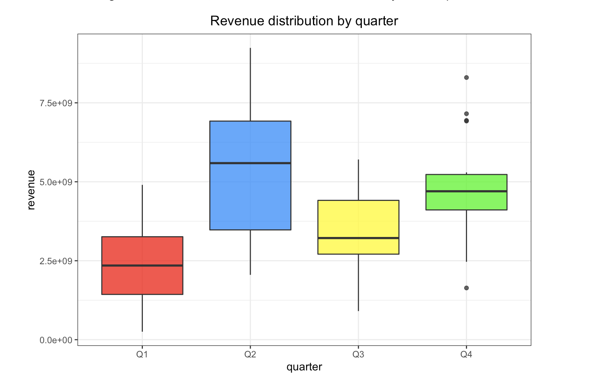
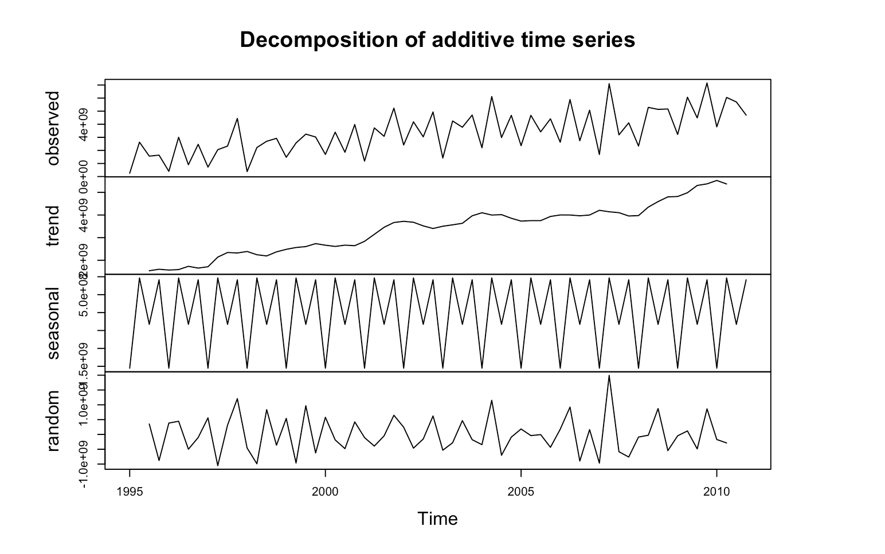
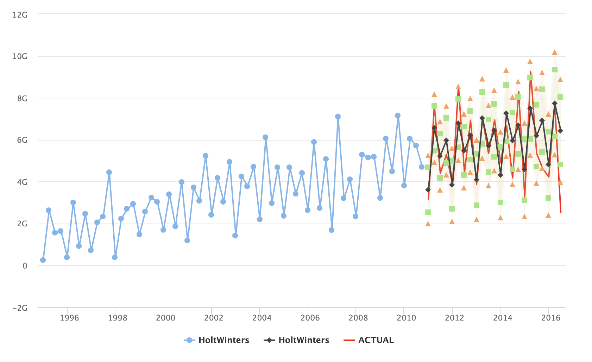
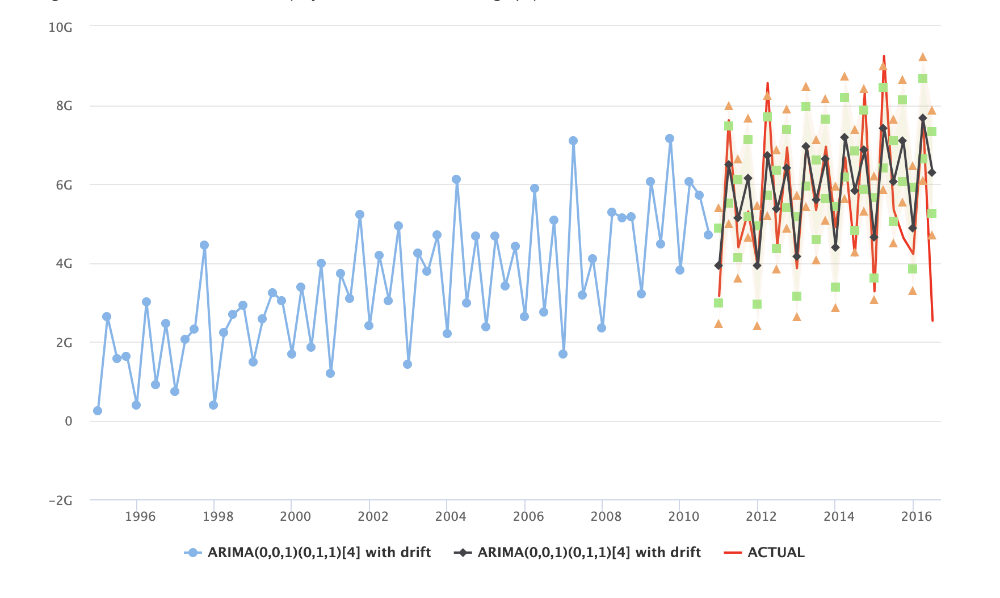

# Topic: Movie Box Office Prediction

Contributors: Tran Hieu Le, Totyana Hill, Fahim Ishrak, Zhilin Wang

Welcome!

This is our final project in Data Science course. In this project, we do data analysis to figure out which are the most important factors to a movie's success. We also construct some models to predict gross box office/revenue and profitability.

[Our summary paper](Summary.html)

---

# Introduction

In recent years, the movie industry has been becoming an important source of entertainment in our modern world. Big studios such as Walt Disney, Universal, Paramount, Warner Bros, and Fox have produced many successful films and achieved impressive gross box office as well as reputation. However, there are also many companies failing in the movie industry, which becomes the main concern of new managers and new directors who want to pursue this career. Therefore, finding the most essential factors contributing to the success of a movie and predicting a movie’s box office revenue play a key role in the film industry. Being aware of a movie’s performance in advance, movie managers can allocate appropriate resources, strategies and adjustments to promote the success of their products.

In this project, we analyze the movie dataset and construct different models to predict the revenue and profitability of a movie using variables such as budget, run time, genres, vote and score (which can be obtained from a test screening) … In addition, we use time series to examine the seasinality and trend of gross box office.

Our goal is to answer the following S.M.A.R.T questions:

1. Which are the most important factors contributing to a movie’s success?
2. Which is the best model to predict the gross box office of a movie?
3. Is there any seasonal pattern in the total revenue of movies? Which period in a year grants movie industry highest box office?

# Data Preprocessing

Our dataset is sourced from [Kaggle website](https://www.kaggle.com/tmdb/tmdb-movie-metadata).

At first, we preprocessed the data using Python to extract information from JSON contents. After that we import the data to R to clean the data and create some new columns which are useful for our analysis such as profit, year, season and quarter. All the variables are updated to their correct formats.

# Data Summary

This table is the summary of the continuous variables in the dataset.

The high differences between variables indicate that we need to scale the data.

# Revenue Prediction

This is the summary of three models Linear Regression, Decision Tree and Random Forest in predicting the revenue of movies.

Random Forest has the best performance. There is no sign of overfitting or underfitting in three models.

# Profitability 

In this section, we use the binary outcome (0,1).
If a movie has positive profit (revenue > budget), it is labeled as 1; otherwise (negative profit), it is labeled as 0.
We use Logistic Regression, Decision Tree and KNN to predict whether a movie has positive profit or negative profit. 

We calculates the overall accuracies of three models and here are our results:
* Logit: 81.9%
* Decision Tree: 80.3%
* KNN: 77.4%

Overall, the Logistic Regression model has the best prediction accuracy. 

# Time Series

In this section, we study the seasonality and trend in movie gross box office. The results show that the total revenue of movie industry has been increasing and a movie's income tends to be higher higher during April, May, June and October, November, December.

We construct HoltWinters model and ARIMA model to predict the revenue. 

The following graphs show the predictions of two models.

ARIMA model has better performance on the training set, but in predicting an unseen data the predictions of two models are not significant. From my perspective, I prefer the HoltWinters in this case since the actual values always lie in the 95% confidence intervals of HotlWinters' predicted values. In constrast, ARIMA model has some predictions significant from the actual data.

P/s: There are graphs with more detailed visualization in our project. Please check html file or Rmd file for them.

# Conclusion

After analyzing movie dataset and constructing different models, we answer the SMART questions at the beginning and make some conclusions:

* According to our research, budget, popularity, vote, movie studios and genres are the most important factors contributing to a movie’s success.
* Random Forest has the best performance in predicting the gross box office among three models (Linear Regression, Decision Tree and Random Forest).
* To predict whether a movie has positive profit or negative profit, Logistic Regression has better accuracy than KNN and Decision Tree. We do not try Random Forest in this section, but in my opinion, Random Forest would have better result than Logistic Regression. Random Forest makes use of the combination concept in machine learning by ensembling many decision trees to reduce the Out-Of-Bag Errors. The model is also very powerful in dealing with high dimensionality.
* We observe a seasonal pattern and an increasing trend in the revenue. Both HoltWinters and ARIMA models do well in predicting the revenue in the future, but I prefer the HoltWinters in this case since the actual values never surpass the 95% confidence intervals of HotlWinters’ predictions.

In summary, we have some suggestions for new movie managers and directors. To achieve success in the movie industry, they should pay attention to the budget, popularity, score and the genres of their movies. April, May and June would be the ideal periods to release their movies.

# References

[https://towardsdatascience.com/](https://towardsdatascience.com/)

[https://stats.idre.ucla.edu/r/dae/](https://stats.idre.ucla.edu/r/dae/)

[https://stackoverflow.com/](https://stackoverflow.com/)

[https://www.kaggle.com/learn-forum](https://www.kaggle.com/learn-forum)

[https://www.r-bloggers.com/](https://www.r-bloggers.com/)

[https://www.datacamp.com/tracks/r-programming](https://www.datacamp.com/tracks/r-programming)

[https://www.forbes.com/](https://www.forbes.com/sites/scottmendelson/2019/12/01/box-office-walt-disney-frozen-2-starring-idina-menzel-and-kristen-bell-breaks-thanksgiving-records-and-tops-738-million-worldwide/#2f2c0c956d80)

